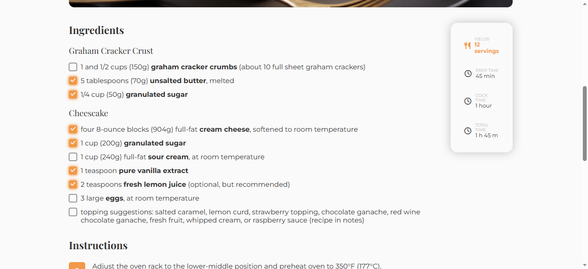

<!-- Please update value in the {}  -->

<h1 align="center">Recipe Blog</h1>

   Solution for a challenge from  <a href="http://devchallenges.io" target="_blank">Devchallenges.io</a>.

  <h3>
    <a href="https://flakobb.github.io/recipe-blog/">
      Demo
    </a>
     | 
    <a href="https://github.com/FlakoBB/recipe-blog">
      Solution
    </a>
     | 
    <a href="https://devchallenges.io/challenges/OEKdUZ6xs0h99C38XVht">
      Challenge
    </a>
  </h3>

<!-- TABLE OF CONTENTS -->

## Table of Contents

- [Overview](#overview)
  - [Built With](#built-with)
- [Features](#features)
- [Contact](#contact)

<!-- OVERVIEW -->

## Overview

Simple page with a recipe.

- Estructured with HTML semantic tags.
- Styled in CSS.

### Built With

- HTML
- CSS

## Features

This application/site was created as a submission to a [DevChallenges](https://devchallenges.io/challenges) challenge. The [challenge](https://devchallenges.io/challenges/TtUjDt19eIHxNQ4n5jps) was to build an application to complete the following user stories:

- [x] User story: This is a completed user stories
- [x] User story: This is a incompleted user stories
- [x] User story: This is a incompleted 2nd user stories

Icons from [FontAwesome](https://fontawesome.com/)

## Contact

- Redes [Follow me](https://bit.ly/follow-flako)
